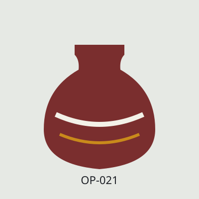

# Тестовий сайт для задачі 24253 «Автооновлення каталогу»

Статичний магазин кераміки «Опішнянська полиця»: 20 товарів, JSON-LD на кожній сторінці товару.
Нічого збирати не треба: це готові HTML-файли для GitHub Pages.

Адреса сайту: https://vnesterenko-tech.github.io/opishnia-test-shop/
Для підключення в кабінеті: `https://vnesterenko-tech.github.io/opishnia-test-shop/index.html`

## Де правити ціну й наявність

Уся ціна й наявність товару живе лише у файлі `product/<товар>.html`, у двох місцях:

- **Блок JSON-LD** у `<head>` (позначений коментарем «ДАНІ ДЛЯ КРАУЛЕРА»):
  - `"price": "950"` — ціна;
  - `"availability": "https://schema.org/InStock"` — статус: `InStock`, `OutOfStock`,
    `BackOrder` (під замовлення), `PreOrder` (очікується);
  - `"inventoryLevel": { "value": 5 }` — кількість.
- **Видимий текст** між коментарями «ВИДИМІ ДАНІ» і «КІНЕЦЬ ВИДИМИХ ДАНИХ»:
  `950 грн`, `В наявності: 5 шт.`, `Немає в наявності (0 шт.)`, `Під замовлення` тощо.

Міняйте обидва місця однаково. На головній і в категоріях цін немає навмисно, щоб не правити в трьох місцях.

Формати видимого тексту для трьох правил із ТЗ:

| Правило | JSON-LD | Видимий текст |
|---|---|---|
| 1. Є кількість | `availability` + `inventoryLevel` | `В наявності: 5 шт.` / `Немає в наявності (0 шт.)` |
| 2. Лише статус | тільки `availability`, без `inventoryLevel` | `Під замовлення` / `Очікується` / `Немає в наявності` / `В наявності` |
| 3. Нічого | ні `availability`, ні `inventoryLevel` | рядка наявності немає |

## Товари в стартовому стані

| Файл | Що на сторінці | Навіщо |
|---|---|---|
| hlechyk-1-5l, horshchyk-0-6l, tarilka-25, myska-salatna-30, kukhol-piven, barylce-2l, kashpo-opishnia | кількість > 0 | правило 1, in_stock = true |
| makitra-3l | кількість 5 | «а 10 штук є?» |
| nabir-horshchykiv-4, nabir-mysok-3 | кількість + стара ціна | old_price, знижка |
| silnychka, tsukornytsia | кількість 0 | in_stock = false |
| svyshchyk-baranets | «Під замовлення», доставка 14 дн. | правило 2 |
| vaza-60 | «Очікується», доставка 21 дн. | правило 2 |
| tarilka-nastinna | «Немає в наявності» без кількості | правило 2, in_stock = false |
| hornyatko-150 | «В наявності» без кількості | правило 2 |
| oliynytsia, pidstavka-pid-hariache, svichnyk-lev | нічого | правило 3, in_stock без змін |
| forma-pyrih-28 | кількість 6, доставка 3 дн. | delivery_time_days |

## Сценарій «оновлення» (чекліст п. 2, 44)

Після першого скрапінгу і ручних правок у кабінеті (опис товару «Горщик», approved = true):

| Що зробити | Файл | Очікування після оновлення |
|---|---|---|
| Ціна 680 → 720 | hlechyk-1-5l.html | нова ціна, бот каже 720 |
| Кількість 5 → 0, `InStock` → `OutOfStock` | makitra-3l.html | in_stock = false |
| Змінити опис на сайті | horshchyk-0-6l.html | ручний опис у кабінеті лишився |
| «В наявності» → «Немає в наявності», `InStock` → `OutOfStock` | hornyatko-150.html | in_stock = false |
| Видалити товар | прибрати `<li>` з kukhol-piven з `index.html`, `category/stolovyi.html`, рядок із `sitemap.xml` і сам файл | запис лишився, in_stock = false, «не знайдено на сайті» |
| Додати товар | перенести `zapas/makitra-1l.html` у `product/`, додати посилання (див. нижче) | новий товар з approved = false |

Посилання для нового товару — вставити в `index.html` і `category/gotuvannya.html` всередину `<ul class="list">`
(у категорії шлях `../product/...` і `../img/...`):

    <li><a href="product/makitra-1l.html">
    
    Макітерка мала 1 л</a></li>

і в `sitemap.xml`: `<url><loc>https://vnesterenko-tech.github.io/opishnia-test-shop/product/makitra-1l.html</loc></url>`.

Результат: на сайті 20 товарів, у каталозі 21 запис.

## Інші сценарії

- **Менше половини товарів (п. 6).** Прибрати з `index.html`, категорій і `sitemap.xml` посилання на
  15 із 20 товарів → запуск відхилено, каталог без змін, лист власнику. Потім повернути.
- **Сайт недоступний.** Settings → Pages → Unpublish (або перейменувати `index.html`) → запуск невдалий,
  каталог без змін, ліміт не списано, лист є.
- GitHub Pages оновлюється 1–2 хвилини після коміту — дочекайтеся перед запуском оновлення.
